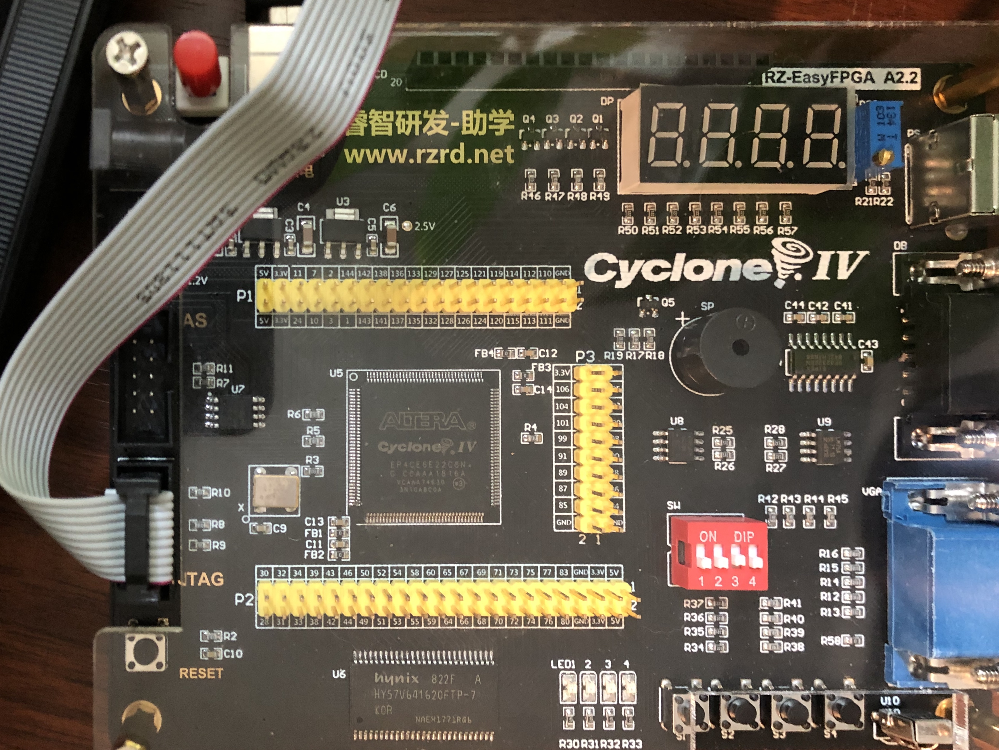
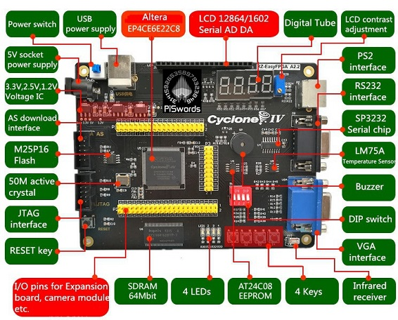

# CET466 Digital Logic

This repository is for the [CCSU Fall 2020 CET466 Digital Logic course](https://ccsu.smartcatalogiq.com/en/current/Undergraduate-Graduate-Catalog/All-Courses/CET-Computer-Electronics-Technology/400/CET-466).

The course will be using the RZ-EasyFPGA board which is a nice, inexpensive board that uses a Cyclone IV chip.

This image shows some of the features of the board.

The pinouts are shown below.

## Some Links

[Most of this repository is a downloaded and unrarred version of the files here.](http://fpga.redliquid.pl/) I figured a GitHub repository might be more accessible.

[The original manufacturer of the board seems to be here.](http://www.rzrd.net/product/?79_502.html)

I found the pinout image above on [Hey There Buddo!](https://www.philipzucker.com/simple-fpga-stuff/).

This page says how to run [Quartus on a Mac](https://ezcontents.org/altera-quartus-mac-osx), however, I was not successful in getting it to be able to program the board using the USB blaster. It does all the compulation etc. fine, just doesn't blow the board (either JTAG or AS).

This page shows quite detailed instructions about getting the [board running under Windows.](https://gojimmypi.blogspot.com/2018/02/first-fpga-test-drive-with-altera.html). Note that this page uses Verilog, but the course will be taught using VHDL.

There are some other GitHub repositories around that reference the RZ EasyFPGA board. [Here's one that I cloned](https://gist.github.com/kootsoop/9a52aca63f8885c351363b1a7407282b)

[To download Quartus Prime v20.1, go to the Intel site and download it. Be warned: it's LARGE.](https://fpgasoftware.intel.com/20.1/?edition=lite)

To clone this repository on Windows, you need to have [long file names enabled](https://stackoverflow.com/questions/22575662/filename-too-long-in-git-for-windows) by running `git config --system core.longpaths true`. Otherwise `git` will give an error about `Clone succeeded but checkout failed.`

Some more information, including the marked up image showing the board features above is available from [here](http://piswords.com/ep4ce6e22c8n.html).

The [NAND2Tetris text book](https://www.nand2tetris.org/) was the inspiration [for this repository](https://gitlab.com/x653/nand2tetris-fpga/)

## Some Videos

 There are several videos on YouTube using the board, though most are not in English:
 
  * [Sample blinking the LEDs](https://www.youtube.com/watch?v=sspek_3XA6A) This YouTuber has several other videos about the board.
  * [This doesn't use our board, but it's a good first step in how to use Quartus](https://www.youtube.com/watch?v=RAD9Y8JGY9s)
  * [This one uses VHDL and is a good start-up demonstration](https://www.youtube.com/watch?v=t72x_zZdDPs)

An example edit.
